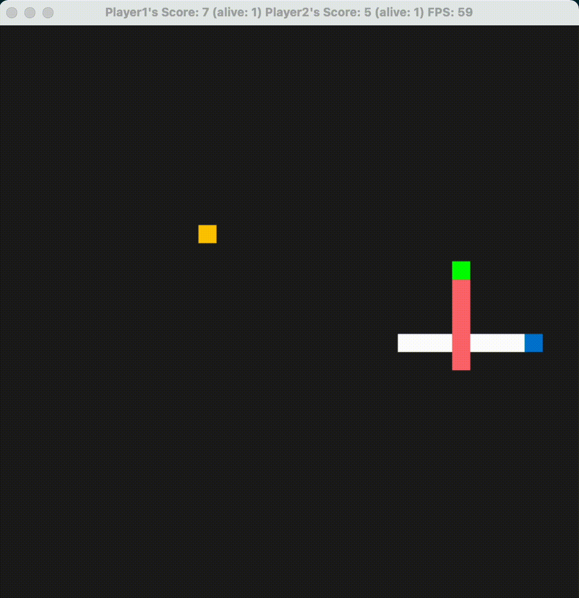

# CPPND: Capstone Snake Game Example

This is a starter repo for the Capstone project in the [Udacity C++ Nanodegree Program](https://www.udacity.com/course/c-plus-plus-nanodegree--nd213). The code for this repo was inspired by [this](https://codereview.stackexchange.com/questions/212296/snake-game-in-c-with-sdl) excellent StackOverflow post and set of responses.

In this project, I extended [Snake game sample code](https://github.com/udacity/CppND-Capstone-Snake-Game) with the following new features in order to satisfy the requiements of the [rubric](https://github.com/AkihiroNomura/CppND-Capstone-Snake-Game#rubric-criteria).

## New Features
* Start Instruction
  * You will see the start instruction at the beginning of the game, including game mode selection (`1` for single player and `2` for double player), control keys, and input of player name.
* Game Mode
  * The game supports both single player mode and double player mode chosen by the user. Under double player mode, two snakes will compete for the food, whoever get it first will have score and speed increased. Once one snake dies, it will show up in the screen for 2 seconds before disappearing.
* Record File
  * After the first run, a file `records.txt` will be created in the root directory. At the finish of each run, this file will be updated to store the highest score of each player, in descending order.
* Hash Table
  * The search function used to check whether there is self-crossing or place new food has been optimized using a hash table of points, which is more efficient than iterating over a vector. This is achieved by defining an inherited class `Snake_Point` of `SDL_Point` inside `snake.h`.

## Dependencies for Running Locally
* cmake >= 3.7
  * All OSes: [click here for installation instructions](https://cmake.org/install/)
* make >= 4.1 (Linux, Mac), 3.81 (Windows)
  * Linux: make is installed by default on most Linux distros
  * Mac: [install Xcode command line tools to get make](https://developer.apple.com/xcode/features/)
  * Windows: [Click here for installation instructions](http://gnuwin32.sourceforge.net/packages/make.htm)
* SDL2 >= 2.0
  * All installation instructions can be found [here](https://wiki.libsdl.org/Installation)
  * Note that for Linux, an `apt` or `apt-get` installation is preferred to building from source. 
* gcc/g++ >= 5.4
  * Linux: gcc / g++ is installed by default on most Linux distros
  * Mac: same deal as make - [install Xcode command line tools](https://developer.apple.com/xcode/features/)
  * Windows: recommend using [MinGW](http://www.mingw.org/)

## Basic Build Instructions

1. Clone this repo.
2. Make a build directory in the top level directory: `mkdir build && cd build`
3. Compile: `cmake .. && make`
4. Run it: `./SnakeGame`.

## Rubric Criteria
The following criteria are satisfied in this project.

**Loops, Functions, I/O**
* The project demonstrates an understanding of C++ functions and control structures.
  * For example, in `main.cpp`, I use a while loop and try-catch statement to get input of game mode.
* The project reads data from a file and process the data, or the program writes data to a file.
  * The member function `Game::UpdateRecords` reads data from the local file `records.txt` and updates it by including the new results.
* The project accepts user input and processes the input.
  * In `main.cpp`, the user will input the game mode and player names, which are used to configure the classes such as `Snake` and `Game`.

**Object Oriented Programming**
* Classes follow an appropriate inheritance hierarchy.
  * Struct `Snake_Point` is inherited from `SDL_Point` with public inheritance. The purpose is to overload the `==` operator so as to support the hash table implemented by `std::unordered_set`.

**Memory Management**
* The project makes use of references in function declarations.
  * When the input parameter is a `std::vector`, I try to use reference. E.g. see the constructor of class `Game` and `Renderer::Render`.
* The project uses move semantics to move data, instead of copying it, where possible.
  * In function `Renderer::Render`, I use move semantics to move the `block` variable into function `std::async`.
* The project uses smart pointers instead of raw pointers.
  * I use a vector of shared pointers as the member `snakes` in class `Game`. The project does not use any raw pointers.

**Concurrency**
* The project uses multithreading.
  * The update and render of each snake are handled by multiple threads. See functions `Game::Update` and `Renderer::Render`.
* A mutex or lock is used in the project.
  * I use `std::lock_guard` in functions `Game::UpdateOneSnake` and `Render::RenderOneSnake` to protect shared resources such as `food`.
